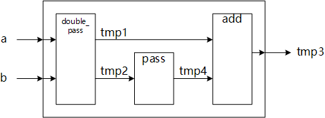

# U50

Practice setting:

* Vitis 2022.1 windows GUI
* set_part {xcu50-fsvh2104-2L-e}
* c-synthesis with "Vivado IP Flow Target"

**ATTENTION:**

All the memory like ```tmp1[128]/tmp2[128]/tmpX[128]``` are structured with 128*2 address (like tmp1[128][2]) after implimented, the odd writing from 0~127 address and even take different bank inside, and that is why ```double_pass``` and ```pass``` can work overlaping in ```middle_pass.problem```. It is OK for FPGA, but not good for ASIC.

## input_bypass

* problem

  * [source code](https://github.com/Xilinx/Vitis-HLS-Introductory-Examples/blob/master/Dataflow/Bypassing/input_bypass/dut.cpp)

  * functional block diagram

  

  * detail diagram

  

  * c-synthesis resource

  

  * cosim result

  ```log
  ////////////////////////////////////////////////////////////////////////////////////
  // RTL Simulation : 0 / 4 [0.00%] @ "125000"
  // RTL Simulation : 1 / 4 [32.57%] @ "4015000"
  // RTL Simulation : 2 / 4 [32.57%] @ "6605000"
  // RTL Simulation : 3 / 4 [32.57%] @ "9195000"
  // RTL Simulation : 4 / 4 [100.00%] @ "11785000"
  ////////////////////////////////////////////////////////////////////////////////////
  ```

  

* solution

  * [source code](https://github.com/Xilinx/Vitis-HLS-Introductory-Examples/blob/master/Dataflow/Bypassing/input_bypass/dut_sol.cpp)

  * functional block diagram

  

  * detail diagram

  

  * c-synthesis resource

    **Double_pass/add_kernel have unused variables j, wasted resource.**

  

  * cosim result

  ```log
  ////////////////////////////////////////////////////////////////////////////////////
  // RTL Simulation : 0 / 4 [0.00%] @ "125000"
  // RTL Simulation : 1 / 4 [65.57%] @ "4035000"
  // RTL Simulation : 2 / 4 [65.57%] @ "5335000"
  // RTL Simulation : 3 / 4 [65.57%] @ "6645000"
  // RTL Simulation : 4 / 4 [100.00%] @ "7945000"
  ////////////////////////////////////////////////////////////////////////////////////
  ```

  

## middle_bypass

* problem

  * [source code](https://github.com/Xilinx/Vitis-HLS-Introductory-Examples/blob/master/Dataflow/Bypassing/middle_bypass/dut.cpp)

  * functional block diagram

  

  * detail diagram

  

  * c-synthesis resource

  

  ```log
  ////////////////////////////////////////////////////////////////////////////////////
  // RTL Simulation : 0 / 4 [0.00%] @ "125000"
  // RTL Simulation : 1 / 4 [65.39%] @ "4015000"
  // RTL Simulation : 2 / 4 [65.39%] @ "5315000"
  // RTL Simulation : 3 / 4 [65.39%] @ "7905000"
  // RTL Simulation : 4 / 4 [100.00%] @ "9205000"
  ////////////////////////////////////////////////////////////////////////////////////
  ```

  

* solution

  Same as the solution of input_bypass.

  * c-synthesis resource

    **Less LUT than the solution of input_bypass**, because input_bypass.Double_pass/add_kernel have unused variables j.

  

  ```log
  ////////////////////////////////////////////////////////////////////////////////////
  // RTL Simulation : 0 / 4 [0.00%] @ "125000"
  // RTL Simulation : 1 / 4 [65.39%] @ "4015000"
  // RTL Simulation : 2 / 4 [65.39%] @ "5315000"
  // RTL Simulation : 3 / 4 [65.39%] @ "6615000"
  // RTL Simulation : 4 / 4 [100.00%] @ "7915000"
  ////////////////////////////////////////////////////////////////////////////////////
  ```

## output_bypass

* problem

  * [source code](https://github.com/Xilinx/Vitis-HLS-Introductory-Examples/blob/master/Dataflow/Bypassing/output_bypass/dut.cpp)

  No parallel working at all, not lake middle_bypass, there is no add_kernel can be used to predict working flow.

  ```log
  ////////////////////////////////////////////////////////////////////////////////////
  // RTL Simulation : 0 / 4 [0.00%] @ "125000"
  // RTL Simulation : 1 / 4 [48.85%] @ "2725000"
  // RTL Simulation : 2 / 4 [48.85%] @ "5315000"
  // RTL Simulation : 3 / 4 [48.85%] @ "7905000"
  // RTL Simulation : 4 / 4 [100.00%] @ "10495000"
  ////////////////////////////////////////////////////////////////////////////////////
  ```

* solution

  * [source code](https://github.com/Xilinx/Vitis-HLS-Introductory-Examples/blob/master/Dataflow/Bypassing/output_bypass/dut_sol.cpp)

  ```log
  ////////////////////////////////////////////////////////////////////////////////////
  // RTL Simulation : 0 / 4 [0.00%] @ "125000"
  // RTL Simulation : 1 / 4 [48.85%] @ "2725000"
  // RTL Simulation : 2 / 4 [48.85%] @ "4025000"
  // RTL Simulation : 3 / 4 [48.85%] @ "5325000"
  // RTL Simulation : 4 / 4 [100.00%] @ "6625000"
  ////////////////////////////////////////////////////////////////////////////////////
  ```
