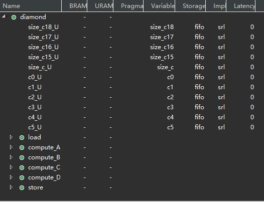

# using_fifos

## setting

* Vitis 2022.1 windows GUI
* set_part {xcu50-fsvh2104-2L-e}
* c-synthesis with "Vivado IP Flow Target"

## pragma

* [#pragma HLS performance target_ti](https://docs.xilinx.com/r/en-US/ug1399-vitis-hls/pragma-HLS-performance)

* [#pragma HLS LOOP_TRIPCOUNT max](https://docs.xilinx.com/r/en-US/ug1399-vitis-hls/pragma-HLS-loop_tripcount)

## illustration

* [source code](https://github.com/Xilinx/Vitis-HLS-Introductory-Examples/blob/master/Dataflow/Channels/using_fifos)

  * functional block diagram

    

  **ATTENTION:** The raw source code raises error while cosim, it can be fixed by changing bare pointer to array, as:

```diff
diff --git a/Dataflow/Channels/using_fifos/diamond.cpp b/Dataflow/Channels/using_fifos/diamond.cpp
index 8fbce6c..ceb058d 100644
--- a/Dataflow/Channels/using_fifos/diamond.cpp
+++ b/Dataflow/Channels/using_fifos/diamond.cpp
@@ -18,7 +18,7 @@
 #define NUM_WORDS 16
 extern "C" {

-void diamond(vecOf16Words* vecIn, vecOf16Words* vecOut, int size)
+void diamond(vecOf16Words vecIn[512], vecOf16Words vecOut[512], int size)
 {
   hls::stream<vecOf16Words> c0, c1, c2, c3, c4, c5;
   assert(size % 16 == 0);
@@ -90,7 +90,7 @@ Loop_D:
   }
 }

-void store(hls::stream<vecOf16Words >& in, vecOf16Words *out, int size)
+void store(hls::stream<vecOf16Words >& in, vecOf16Words out[512], int size)
 {
 Loop_St:
   for (int i = 0; i < size; i++)
diff --git a/Dataflow/Channels/using_fifos/diamond.h b/Dataflow/Channels/using_fifos/diamond.h
index c9a40c6..9d71879 100644
--- a/Dataflow/Channels/using_fifos/diamond.h
+++ b/Dataflow/Channels/using_fifos/diamond.h
@@ -29,7 +29,7 @@ typedef hls::vector<uint32_t, NUM_WORDS> vecOf16Words;

 extern "C" {
 // Top function
-void diamond(vecOf16Words *vecIn, vecOf16Words *vecOut, int size);
+void diamond(vecOf16Words vecIn[512], vecOf16Words vecOut[512], int size);
 }

 // Sub functions
diff --git a/Dataflow/Channels/using_fifos/diamond_test.cpp b/Dataflow/Channels/using_fifos/diamond_test.cpp
index 0ed15f8..90f8dbb 100644
--- a/Dataflow/Channels/using_fifos/diamond_test.cpp
+++ b/Dataflow/Channels/using_fifos/diamond_test.cpp
@@ -23,8 +23,8 @@ int main()
 {

   int totalNumWords = 512;
-  std::vector<vecOf16Words> test(32);
-  std::vector<vecOf16Words> outcome(32);
+  vecOf16Words test[512];
+  vecOf16Words outcome[512];

   int retval = 0;
   ofstream FILE;
@@ -51,7 +51,7 @@ int main()
   for (int iter = 0; iter < 3; iter++)
   {
     // Execute DUT
-    diamond(test.data(), outcome.data(),totalNumWords/16);
+    diamond(test, outcome,totalNumWords/16);

     // Display the results
   cout << "Outcome: " ;

```

* csim result

  ```log
  INFO: [SIM 2] *************** CSIM start ***************
  INFO: [SIM 4] CSIM will launch GCC as the compiler.
     Compiling ../../../../diamond_test.cpp in debug mode
     Compiling ../../../../diamond.cpp in debug mode
     Generating csim.exe
  Init:   0  1  2  3  4  5  6  7  8  9  10  11  12  13  14  15
    0  1  2  3  4  5  6  7  8  9  10  11  12  13  14  15
    0  1  2  3  4  5  6  7  8  9  10  11  12  13  14  15
    0  1  2  3  4  5  6  7  8  9  10  11  12  13  14  15
    0  1  2  3  4  5  6  7  8  9  10  11  12  13  14  15
    0  1  2  3  4  5  6  7  8  9  10  11  12  13  14  15
    0  1  2  3  4  5  6  7  8  9  10  11  12  13  14  15
    0  1  2  3  4  5  6  7  8  9  10  11  12  13  14  15
    0  1  2  3  4  5  6  7  8  9  10  11  12  13  14  15
    0  1  2  3  4  5  6  7  8  9  10  11  12  13  14  15
    0  1  2  3  4  5  6  7  8  9  10  11  12  13  14  15
    0  1  2  3  4  5  6  7  8  9  10  11  12  13  14  15
    0  1  2  3  4  5  6  7  8  9  10  11  12  13  14  15
    0  1  2  3  4  5  6  7  8  9  10  11  12  13  14  15
    0  1  2  3  4  5  6  7  8  9  10  11  12  13  14  15
    0  1  2  3  4  5  6  7  8  9  10  11  12  13  14  15
    0  1  2  3  4  5  6  7  8  9  10  11  12  13  14  15
    0  1  2  3  4  5  6  7  8  9  10  11  12  13  14  15
    0  1  2  3  4  5  6  7  8  9  10  11  12  13  14  15
    0  1  2  3  4  5  6  7  8  9  10  11  12  13  14  15
    0  1  2  3  4  5  6  7  8  9  10  11  12  13  14  15
    0  1  2  3  4  5  6  7  8  9  10  11  12  13  14  15
    0  1  2  3  4  5  6  7  8  9  10  11  12  13  14  15
    0  1  2  3  4  5  6  7  8  9  10  11  12  13  14  15
    0  1  2  3  4  5  6  7  8  9  10  11  12  13  14  15
    0  1  2  3  4  5  6  7  8  9  10  11  12  13  14  15
    0  1  2  3  4  5  6  7  8  9  10  11  12  13  14  15
    0  1  2  3  4  5  6  7  8  9  10  11  12  13  14  15
    0  1  2  3  4  5  6  7  8  9  10  11  12  13  14  15
    0  1  2  3  4  5  6  7  8  9  10  11  12  13  14  15
    0  1  2  3  4  5  6  7  8  9  10  11  12  13  14  15
    0  1  2  3  4  5  6  7  8  9  10  11  12  13  14  15
  Outcome: Outcome: Outcome: Test passed !
  INFO: [SIM 1] CSim done with 0 errors.
  INFO: [SIM 3] *************** CSIM finish ***************
  ```

* c-synthesis & cosim

  Using **Vivado IP Flow Target**

  * resource:

    

    

  * log:

    ```log
    ////////////////////////////////////////////////////////////////////////////////
    // RTL Simulation : 0 / 3 [0.00%] @ "113000"
    // RTL Simulation : 1 / 3 [16.28%] @ "378000"
    // RTL Simulation : 2 / 3 [16.28%] @ "608000"
    // RTL Simulation : 3 / 3 [100.00%] @ "838000"
    ////////////////////////////////////////////////////////////////////////////////
    ```

  * timing:

    

* Change tcl setting:

  * disable ```run_hls.tcl:33``` as ```# config_dataflow -default_channel fifo -fifo_depth 2```

    * The result is the same as the original Git.

  * disable ```run_hls.tcl:33``` and add pragma about using FIFO in source code:

    ```cpp
    //diamond.cpp:21
    void diamond(vecOf16Words vecIn[512], vecOf16Words vecOut[512], int size)
    {
      hls::stream<vecOf16Words> c0, c1, c2, c3, c4, c5;
    #pragma HLS STREAM variable = c0 depth = 2
    #pragma HLS STREAM variable = c1 depth = 2
    #pragma HLS STREAM variable = c2 depth = 2
    #pragma HLS STREAM variable = c3 depth = 2
    #pragma HLS STREAM variable = c4 depth = 2
    #pragma HLS STREAM variable = c5 depth = 2
    #pragma HLS BIND_STORAGE variable = c0 type = FIFO impl = SRL
    #pragma HLS BIND_STORAGE variable = c1 type = FIFO impl = SRL
    #pragma HLS BIND_STORAGE variable = c2 type = FIFO impl = SRL
    #pragma HLS BIND_STORAGE variable = c3 type = FIFO impl = SRL
    #pragma HLS BIND_STORAGE variable = c4 type = FIFO impl = SRL
    #pragma HLS BIND_STORAGE variable = c5 type = FIFO impl = SRL
      assert(size % 16 == 0);
    
      #pragma HLS dataflow
      load(vecIn, c0, size);
      compute_A(c0, c1, c2, size);
      compute_B(c1, c3, size);
      compute_C(c2, c4, size);
      compute_D(c3, c4,c5, size);
      store(c5, vecOut, size);
    }
    ```

    * The result is the same as the original Git, and with **NO** warnings like:

      ```log
      WARNING: [HLS 200-805] An internal stream 'c0' with default size can result in deadlock. Please consider resizing the stream using the directive 'set_directive_stream' or the 'HLS stream' pragma.
      ```

    * **So using pragma maybe the best way.**
