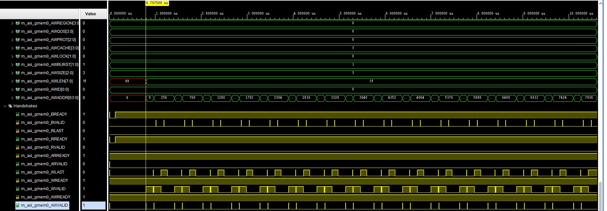

# pragma HLS INTERFACE m_axi

* [source code](https://github.com/Xilinx/Vitis-HLS-Introductory-Examples/blob/master/Interface/Streaming/axi_stream_to_master/example.cpp)

* max_write_burst_length
  Less max_write_burst_length may reduce latency, something counterintuitive.

  * #pragma HLS INTERFACE m_axi max_write_burst_length = ```256``` latency = 10 depth = 1024 bundle = gmem0 port = outTop

    

  * #pragma HLS INTERFACE m_axi max_write_burst_length = ```32``` latency = 10 depth = 1024 bundle = gmem0 port = outTop

    

  ```Write length=64``` requires 1 burst if burst_length=256, requires 2 bursts if burst_length=32, but burst starts 32cycles earlier than burst_length=256 when burst_length=32.
